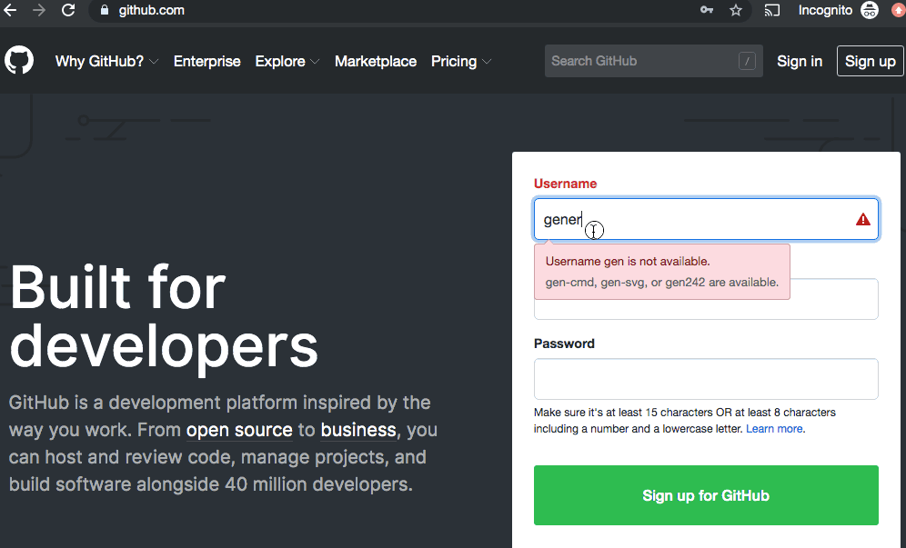

# Small Organization Website Template
Simple Jekyll based website for small organizations

This template is great for a small organization looking to save costs from hosting on [Wordpress](https://wordpress.com/), [Wix](https://www.wix.com/) or [Squarespace](https://www.squarespace.com/). This template can be forked to make a simple DIY website for a small  organization, club or group and host it on github free. If desired, a domain name can be purchased (<$15/yr) and linked to the freely hosted github page.

Example of this Template can be found here: [https://swerty24.github.io/SmallOrganizationWebsite/](https://swerty24.github.io/SmallOrganizationWebsite/)

[Documentation about Github Pages](https://help.github.com/en/articles/getting-started-with-github-pages)

## Steps to Using this Template for your website
### 0. Sign up for Github
Create a Github Account and verify it.
{:height="700px" width="400px"}
