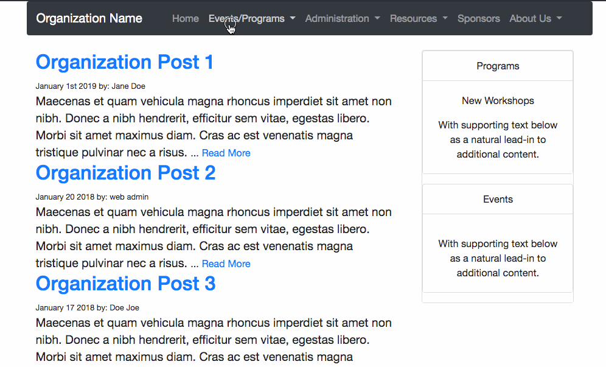

# Small Organization Website Template
This is a Simple [Jekyll](https://jekyllrb.com) based website for small organizations to use and modify as a template.

This template is great for a small organization looking to save costs from hosting on [Wordpress](https://wordpress.com/), [Wix](https://www.wix.com/) or [Squarespace](https://www.squarespace.com/). This template can be forked to make a simple DIY website for a small  organization, club or group and host it on github free. If desired, a domain name can be purchased (<$15/yr) and linked to the freely hosted [github pages](https://help.github.com/en/articles/getting-started-with-github-pages). This template utilizes .yml files to store data presented on the website for simplification and clarify with minimal programing experience required to use.



### LIVE DEMO: [https://swerty24.github.io/SmallOrganizationWebsite/](https://swerty24.github.io/SmallOrganizationWebsite/)

## Template Features
  * Calendar using [FullCalendar]()
  * Photo and contact cards for members of organizations
  * Sponsorship cards for supporting companies
  * Detailed list of Job Postings
  * Customizable for any use, licensed under MIT license (ie. do what you want)

## Steps to Using this Template for your website
### 0. Sign up for Github
Create a Github Account and verify it.


### 1. Fork SmallOrganizationWebsite repository
Fork the Small Organization Website repository into your github account. Enable github pages for the repository.


### 2. Modify template as necessary
Modify the README file to match your new website. Delete the demo website items.
Possible edits include:
- \_config.yml
- Everything in the \_data folder
- assets\images folder for updating relevant images
- Everything in the pages folder
- Modify/add events to the \_events folder


You can make any additional changes to the template code if desired for your specific website. For major changes to the code that can improve the template feel free to submit a [pull request](https://help.github.com/en/github/collaborating-with-issues-and-pull-requests/about-pull-requests).


### 3. Clone repository to your local computer for additional editing and personalization
Instead of editing the entire site on github, you can clone the repository to your local computer after [setting up github](https://kbroman.org/github_tutorial/pages/first_time.html). From the terminal in the folder you would like to work in, type:
```
$ git clone https://github.com/swerty24/SmallOrganizationWebsite.git
```

Make edits locally using [an editor of your choice](https://github.com/atom/atom). Update your repository with [push commands](https://help.github.com/en/github/using-git/pushing-commits-to-a-remote-repository).
