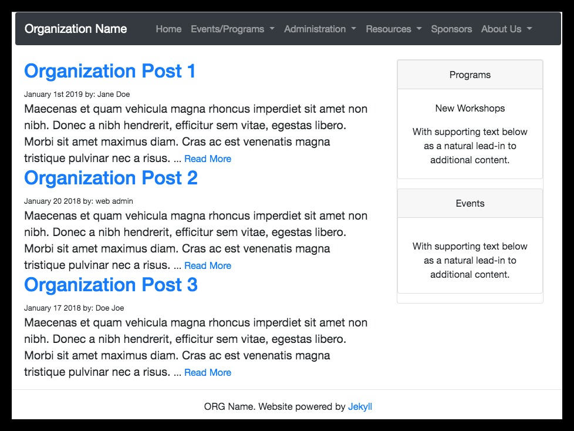

# Small Organization Website Template
This is a Simple [Jekyll](https://jekyllrb.com) based website for small organizations to use and modify as a template.

This template is great for a small organization looking to save costs from hosting on [Wordpress](https://wordpress.com/), [Wix](https://www.wix.com/) or [Squarespace](https://www.squarespace.com/). This template can be forked to make a simple DIY website for a small  organization, club or group and host it on github free. If desired, a domain name can be purchased (<$15/yr) and linked to the freely hosted [github pages](https://help.github.com/en/articles/getting-started-with-github-pages). This template utilizes .yml files to store data presented on the website for simplification and clarify with minimal programing experience required to use.

Live Demo: [https://swerty24.github.io/SmallOrganizationWebsite/](https://swerty24.github.io/SmallOrganizationWebsite/)

## Template Features
  * Calendar using [FullCalendar]()
  * Photo and contact cards for members of organizations
  * Sponsorship cards for supporting companies
  * Detailed list of Job Postings
  * Customizable for any use, licensed under MIT license (ie. do what you want)

## Steps to Using this Template for your website
### 0. Sign up for Github
Create a Github Account and verify it.

### 1. Create new repository
### 2. Clone SmallOrganizationWebsite repository
### 3. Modify template as necessary
The \_config.yml and \_data folder is where most edits can take place to change the content on the website.
You can make any additional changes to the template code if desired for your specific website.
